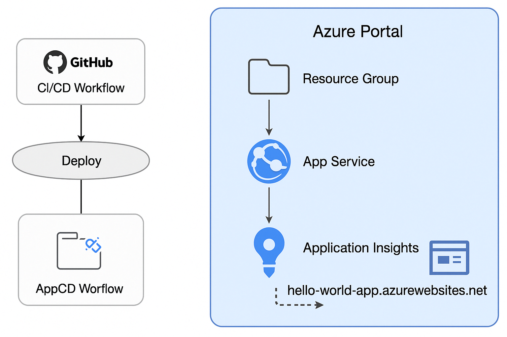

# Azure Hello World App with Terraform & GitHub Actions

> One-click deployment of a Hello World app to Azure using Terraform & GitHub Actions.

This project demonstrates how to:
 - Deploy an Azure App Service on Free Tier
 - Use Terraform for Infrastructure-as-Code
 - Connect Application Insights
 - Automate deploys using GitHub Actions

## Project Structure
- `main.tf`: Terraform infrastructure as code
- `.github/workflows/deploy.yml`: CI/CD pipeline using GitHub Actions
- `app/index.html`: Static Hello World frontend

## Architecture

## Requirements
 - Azure account
 - Service Principal with Contributor role
 - GitHub secrets:
   - 'ARM_CLIENT_ID'
   - 'ARM_CLIENT_SECRET'
   - 'ARM_SUBSCRIPTION_ID'
   - 'ARM_TENANT_ID'

## Deploy

This project is designed for **one-click deployment** on push to `main` branch via GitHub Actions.

You can also deploy manually via GitHub Actions web interface under the **"Actions"** tab.

⚠️ Note: Resources are created only once. Re-deployment without infrastructure change will not modify existing Azure resources.

Push to 'main' branch to deploy

## Outputs

The deployed App Service URL is shown in GitHub Actions output after successful run.

Example:  
`https://hello-world-app-ysanew-2304.azurewebsites.net`
